# 基于springboot的学生评奖评优管理系统

#### 介绍

我开发了一个基于SpringBoot的学生评奖评优管理系统，旨在通过科学、系统化的管理手段提升学生评奖评优的公平性和效率。该系统设计了管理端、教师端和学生端三种角色，分别承担不同的管理和操作职能。系统主要功能包括学生信息管理、成绩管理、奖学金申请及评审、获奖证书管理、纪律通报等。通过这一系统，各角色之间的协同工作得到优化，评奖评优过程更加透明、公正。

#### 技术栈

后端技术栈：Springboot+Mysql+Maven

前端技术栈：Vue+Html+Css+Javascript+ElementUI

开发工具：Idea+Vscode+Navicate

#### 系统功能介绍

管理端

个人中心：管理员可以管理个人信息，包括密码修改和联系方式更新。  
学生管理：管理员可以添加、删除和编辑学生信息。  
教师管理：管理员可以管理教师信息，确保教师数据的准确性。  
院系信息管理：管理学校各院系的信息，确保院系数据完整。  
班级信息管理：管理各班级的信息，包括班级的基本情况和学生分布。  
学生成绩管理：录入和管理学生的成绩数据，为评奖评优提供依据。  
奖学金申请管理：管理学生奖学金申请的提交和审批过程。  
奖学金获得情况管理：记录和管理学生获得奖学金的情况。  
信息异议反馈管理：处理学生和教师对系统数据和评奖结果的异议反馈。  
纪律通报管理：记录和管理学生的纪律情况，通报和处理违纪行为。  
系统管理：维护系统的正常运行，管理系统设置和权限分配。  

教师端

个人中心：教师可以管理个人信息，更新联系方式和修改密码。  
学生管理：教师可以查看和管理所教班级的学生信息。  
学生成绩管理：录入和更新学生的成绩，确保数据的准确性。  
获奖证书管理：记录和管理学生获得的各类证书信息。  
好人好事证明管理：记录学生在校期间的好人好事，作为评奖评优的参考。  
纪律通报管理：记录和通报学生的纪律情况，协助管理端处理违纪行为。  

学生端

学生成绩：学生可以查看自己的成绩信息，了解学业情况。  
奖学金申请：学生可以在线提交奖学金申请，查看申请进度。  
奖学金获得情况：查看自己获得奖学金的情况和历史记录。  
获奖证书：查看和管理自己获得的各类证书信息。  
好人好事证明：记录和查看自己在校期间的好人好事。  
信息异议反馈：提交对系统数据或评奖结果的异议反馈，寻求解决。  
纪律通报：查看自己的纪律记录，了解学校对违纪行为的处理。  
个人中心：管理个人信息，修改密码和更新联系方式。  
后台管理：通过后台管理功能，查看和管理与自己相关的数据。  

#### 系统作用

管理端的作用

系统维护与管理：确保系统正常运行，管理各类基础数据。  
数据准确性保障：通过学生管理、教师管理、成绩管理等模块，确保系统数据的准确性和完整性。  
奖学金管理：高效管理奖学金申请和评审过程，确保公平、公正。  
纪律管理：记录和处理学生的纪律情况，维护学校秩序。  

教师端的作用

学生信息管理：方便教师查看和管理学生信息，了解学生的基本情况。  
成绩录入与管理：教师可以高效录入和更新学生成绩，确保成绩数据的准确性。   
奖惩记录管理：通过获奖证书管理和纪律通报管理，全面记录学生在校期间的表现。  

学生端的作用

信息透明：学生可以随时查看自己的成绩、奖学金申请进度和获得情况，了解个人学业和奖惩情况。  
便捷申请：在线提交奖学金申请，简化了传统的申请流程，提高效率。  
反馈机制：通过信息异议反馈模块，学生可以提出对系统数据和评奖结果的异议，促进系统的透明和公平。  

#### 系统功能截图

代码结构

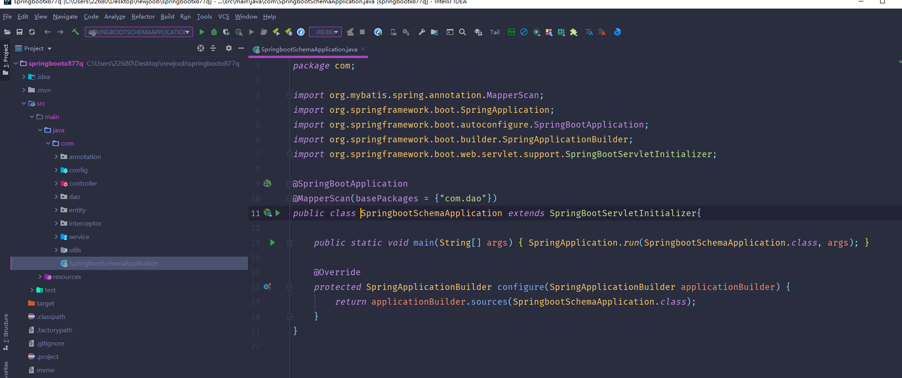

数据库表

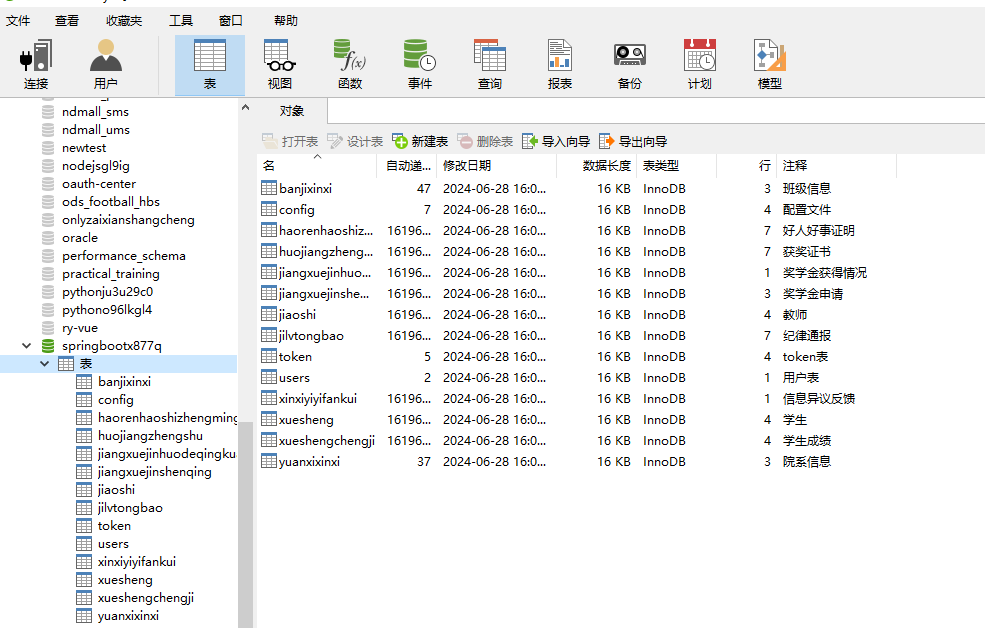

登录

学生管理

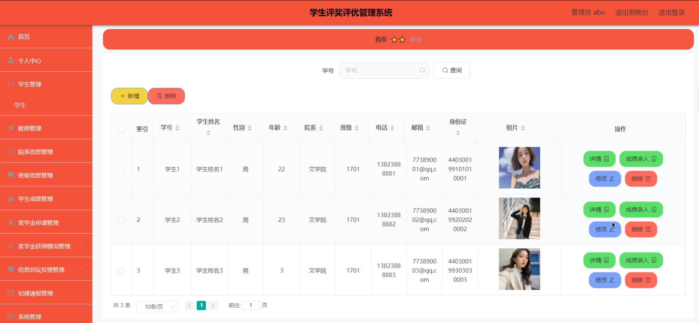

教师管理

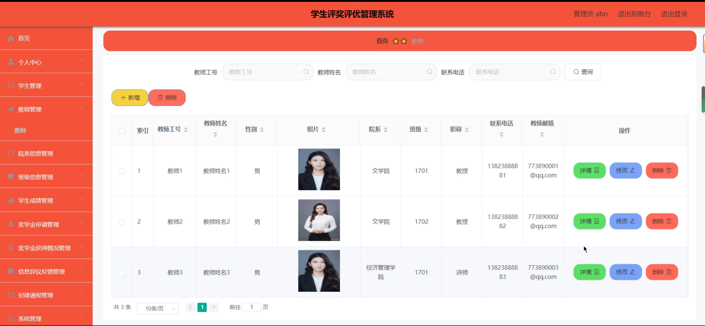

学生成绩管理

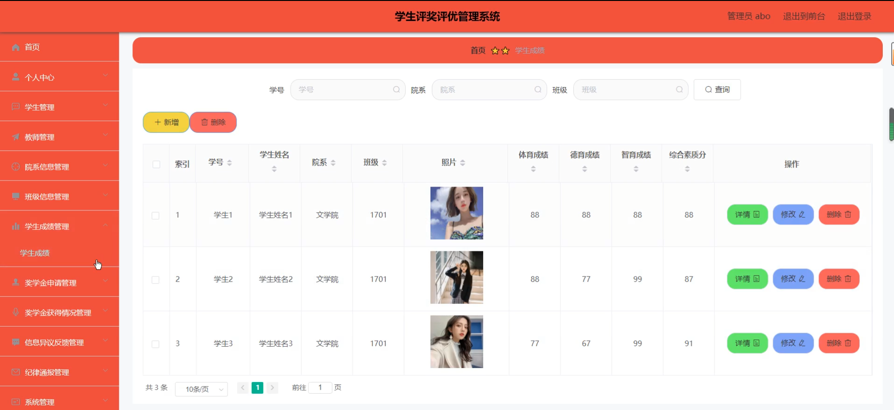

纪律通报管理

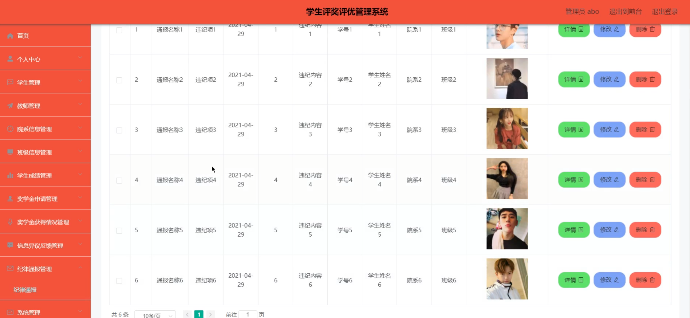

教师端个人信息

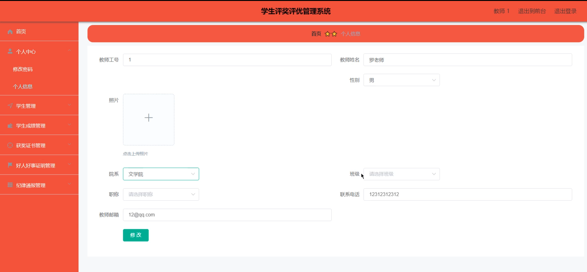

获奖证书管理

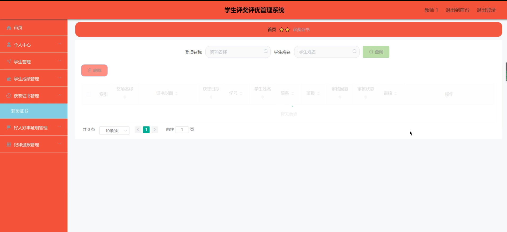

前台页面个人中心

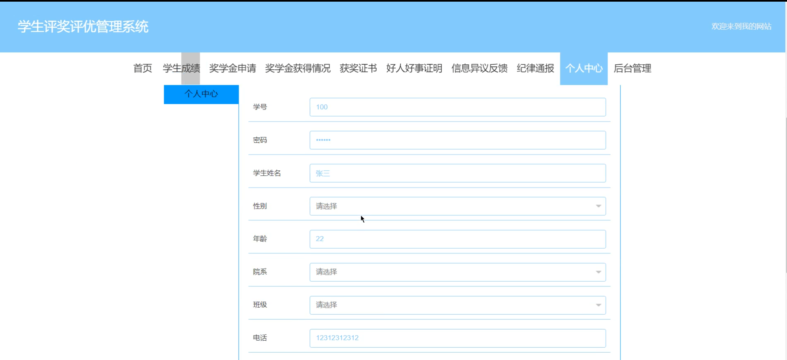

学生成绩

奖学金申请

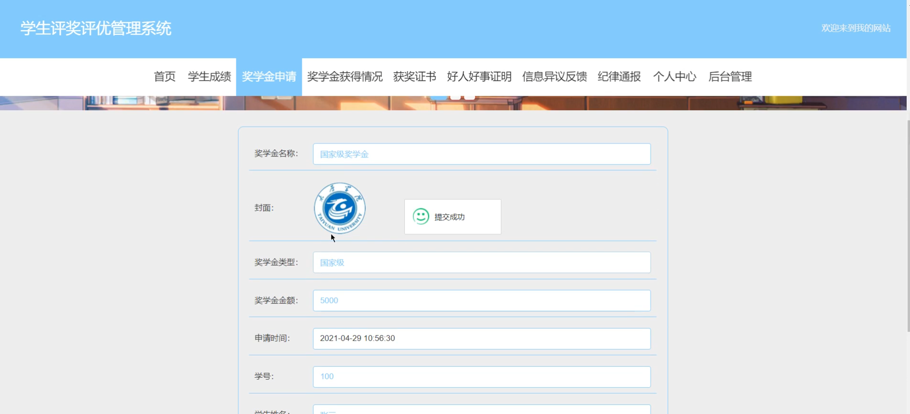

好人好事证明

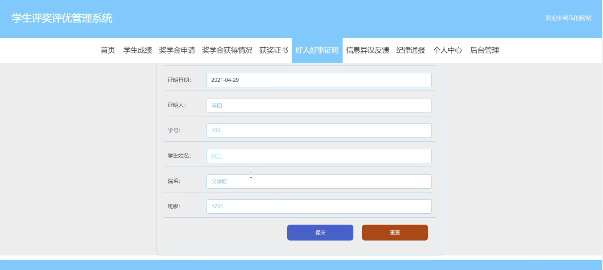

信息异议反馈

#### 总结

基于SpringBoot的学生评奖评优管理系统通过科学化和系统化的管理手段，提升了学校评奖评优工作的效率和公正性。管理端负责系统的总体维护和数据管理，教师端负责学生成绩的录入和奖惩记录的管理，学生端则提供了信息透明和便捷的奖学金申请及反馈渠道。该系统的应用不仅提升了评奖评优过程的透明度和公正性，还为学校管理工作提供了有力的支持和保障。

#### 使用说明

创建数据库，执行数据库脚本 修改jdbc数据库连接参数 下载安装maven依赖jar 启动idea中的springboot项目

后台地址：http://localhost:8080/springbootx877q/admin/dist/index.html

管理员  abo 密码 abo

前台地址：http://localhost:8080/springbootx877q/front/index.html
